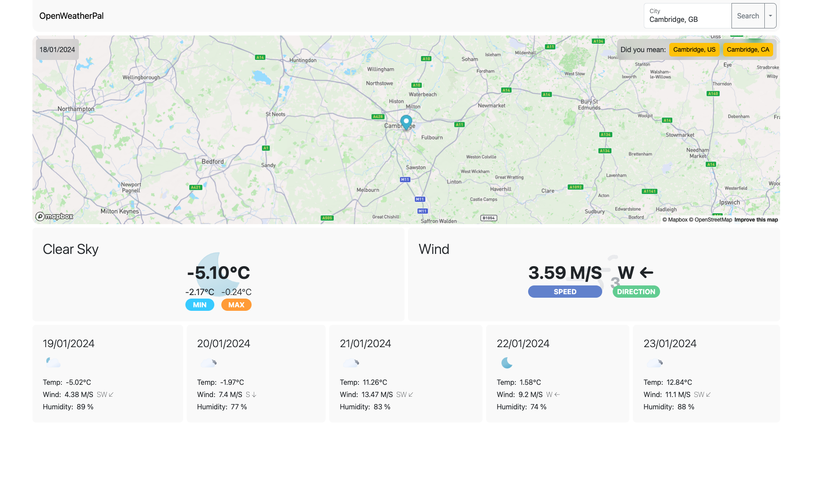

# OpenWeatherPal

[](https://www.javascript.com) 

Live prototype hosted on Github Pages: https://sonictrain.github.io/OpenWeatherPal/

## Table of Contents 
- [Preview](#Preview)
- [Description](#Description)
- [Features](#Features)
- [Technologies](#Technologies)
- [Usage](#Usage)
- [Credits](#Credits)
- [License](#License)

## Preview


## Description
OpenWeatherPal is a web application designed to provide users with current weather information and forecasts for the next 5 days. Leveraging JavaScript (JS), jQuery, Bootstrap for styling, and the OpenWeatherMap API for weather data, the application allows users to search for weather conditions by location name or specify the country using the format [CityName, CountryCode]. Additionally, if there are multiple results for a location search, the app proposes alternative options. The search history and the latest search results are saved in the local storage of the user's browser for quick reference.

## Features
- Search by Location: Users can input the name of a location to check the current weather and the 5-day forecast.
- Interactive Map: User can locate the search on a canvas with an interactive map provide by Mapbox.
- Specify Country: Users can enhance their search by specifying the country using the format [CityName, CountryCode].
- Multiple Results Handling: If a location search yields multiple results, the application proposes alternative options to help users choose the correct location.
- Current Day and 5-Day Forecast: The app provides detailed weather information for the current day and forecasts for the next 5 days.
- Responsive Design with Bootstrap: Utilizes the Bootstrap framework to ensure a responsive and visually appealing design across various devices and screen sizes.
- Search History: The application keeps track of the user's search history, allowing quick access to previous weather queries.
- Local Storage Integration: Utilizes the local storage of the user's browser to persistently store the latest search results and search history.
- Error Handling: Provides informative error messages in case of invalid searches, ensuring a smooth user experience.

## Technologies
- HTML5 for structure.
- CSS3 for styling, with Bootstrap for responsiveness.
- JavaScript for dynamic interaction and event handling.
- jQuery for simplified DOM manipulation.
- dayjs() for the time and date.
- Mapbox for the intreractive map canvas.

## Usage
Simply clone the repo using the following command:
```
git clone <repository-address>
```

cd inside the the repository on your local machine:
```
cd OpenWeatherPal
```

and finally launch the `index.html` file with a browser of your choice.
Alternatively feel free to visit the web app from [this link](https://sonictrain.github.io/OpenWeatherPal/).

## Credits
- [Shield.io](https://shields.io/) for their awesome badges!
- [Weather Icons](https://github.com/basmilius/weather-icons) by Basmilius for the awesome Icon set and the mapping for OWM

## License
[](https://github.com/Naereen/StrapDown.js/blob/master/LICENSE)

Copyright (c) Nicola Brucoli. All rights reserved.
Licensed under the [MIT](./LICENSE) license.